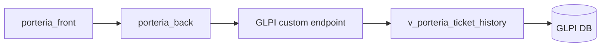
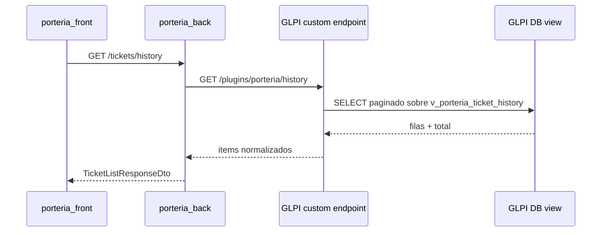

# Endpoint GLPI personalizado para Historial

## Pregunta

Se quiere optimizar `GET /tickets/history` usando una vista SQL en la base de GLPI, pero sin agregar credenciales de base de datos al proyecto `porteria_back`.

La alternativa viable es crear un endpoint personalizado dentro de GLPI, idealmente mediante un plugin propio, y hacer que `porteria_back` consuma ese endpoint usando las credenciales/API tokens de GLPI que ya forman parte de la integracion actual.

## Respuesta corta

Si, se puede evitar que `porteria_back` tenga credenciales directas de la BD creando un endpoint propio en GLPI.

En ese modelo:

- La vista SQL vive en la base de GLPI.
- El endpoint personalizado vive dentro de GLPI o en un componente desplegado junto a GLPI.
- La query a la vista se ejecuta desde el lado GLPI, usando su configuracion interna de conexion a BD.
- `porteria_back` solo llama a un endpoint HTTP autenticado.
- Las credenciales de BD no salen del entorno GLPI.

## Arquitectura propuesta



## Comparacion contra SQL directo desde backend

| Criterio | SQL directo desde `porteria_back` | Endpoint personalizado en GLPI |
|---|---|---|
| Credenciales BD en backend | Si | No |
| Latencia | Muy baja | Baja |
| Complejidad backend | Media | Baja/media |
| Complejidad GLPI | Baja | Media |
| Acoplamiento al esquema GLPI | En backend | Encapsulado en GLPI |
| Seguridad | Requiere usuario read-only y red hacia BD | Reusa frontera HTTP/API GLPI |
| Operacion | Backend + BD | GLPI/plugin + BD |
| Rollback | Feature flag a API GLPI actual | Feature flag a API GLPI actual |

## Ventaja principal

La mejora de performance se conserva porque el listado deja de depender de decenas de llamadas REST por pagina, pero el backend no necesita conectarse directamente a MySQL/MariaDB.

El acoplamiento al esquema de GLPI queda encapsulado dentro del propio GLPI. Si cambia una tabla, columna o regla de visibilidad, el ajuste se concentra en el plugin/endpoint y no en `porteria_back`.

## Como quedaria el flujo



## Diseno recomendado del endpoint

El endpoint deberia aceptar los mismos filtros que hoy usa `GET /tickets/history`, para que `porteria_back` solo tenga que adaptar la fuente de datos:

- `page`
- `limit`
- `statuses`
- `type`
- `search`
- `locationId`
- `locationMode`
- `technicianId`
- `requesterId`
- `dateFrom`
- `dateTo`

Respuesta sugerida:

```json
{
  "items": [
    {
      "id": 123,
      "subject": "Titulo del ticket",
      "status": "assigned",
      "type": "incident",
      "createdAt": "2026-06-01T12:00:00Z",
      "updatedAt": "2026-06-01T13:00:00Z",
      "requester": {
        "id": 10,
        "name": "Usuario solicitante"
      },
      "assignedTo": {
        "id": 20,
        "name": "Tecnico asignado"
      },
      "location": {
        "id": 5,
        "name": "Sede"
      },
      "category": {
        "id": 7,
        "name": "Categoria"
      }
    }
  ],
  "total": 1,
  "page": 1,
  "limit": 15
}
```

## Donde usar la vista SQL

La vista propuesta en `docs/optimizacion-historial-glpi.md` sigue teniendo sentido, pero cambia quien la consume:

- Antes: `porteria_back` consultaba `v_porteria_ticket_history` directamente.
- Ahora: GLPI consulta `v_porteria_ticket_history` y expone el resultado por HTTP.

Esto permite mantener la optimizacion SQL sin abrir acceso de BD al backend.

## Opcion 1 - Plugin GLPI propio

Es la opcion mas limpia si se puede modificar la instancia GLPI.

El plugin puede:

- Registrar una ruta propia para historial.
- Validar autenticacion usando el mecanismo de GLPI.
- Ejecutar consultas contra la BD usando la conexion interna de GLPI.
- Aplicar reglas de entidad/perfil si corresponde.
- Devolver una respuesta estable para `porteria_back`.

Ruta ilustrativa:

```http
GET /plugins/porteria/front/history.php?page=1&limit=15
```

O, si el plugin expone una ruta integrada al API REST de GLPI:

```http
GET /apirest.php/porteria/history?page=1&limit=15
```

La forma exacta depende de la version de GLPI y del mecanismo de routing disponible para plugins en esa instalacion.

## Opcion 2 - Endpoint interno junto a GLPI

Si no conviene tocar GLPI con un plugin, otra posibilidad es desplegar un microservicio interno al lado de GLPI.

En ese caso:

- El microservicio vive en la misma red/host que GLPI.
- Solo ese componente tiene credenciales de BD.
- `porteria_back` consume HTTP.
- La exposicion se limita por red, token y allowlist.

Esta opcion evita credenciales de BD en `porteria_back`, pero no es tan prolija como un plugin porque agrega otro componente operativo.

## Seguridad

Para que el endpoint sea aceptable en produccion:

- Debe requerir autenticacion.
- Debe validar app token/session token o un token interno equivalente.
- Debe aplicar filtros de entidad y permisos equivalentes a los esperados por el sistema.
- Debe limitar `limit` para evitar consultas pesadas.
- Debe validar y parametrizar todos los filtros.
- No debe devolver campos sensibles ni descripcion completa si la grilla no la necesita.
- Debe registrar errores sin exponer SQL ni detalles internos.

Punto importante: la API REST de GLPI aplica reglas de perfil y entidad. Una consulta SQL directa no lo hace automaticamente. Si el endpoint consulta una vista, esa logica debe replicarse o delegarse correctamente antes de devolver datos.

## Cambios necesarios en `porteria_back`

El backend no necesita driver MySQL si se toma este camino.

Cambios esperados:

1. Agregar un metodo en `TicketsGlpiRepository` para llamar al endpoint optimizado.
2. Mapear la respuesta del endpoint al dominio actual (`DomainTicket` o DTO equivalente).
3. Agregar un feature flag, por ejemplo:

```env
GLPI_HISTORY_SOURCE=api|glpi_custom
```

4. Mantener fallback al flujo REST actual.
5. Medir latencia y tasa de error por fuente.

## Plan de implementacion

1. Validar en GLPI real la vista `v_porteria_ticket_history`.
2. Definir reglas para multiples solicitantes/tecnicos.
3. Definir reglas de entidad, perfil y visibilidad.
4. Crear plugin o endpoint interno en ambiente DEV.
5. Exponer endpoint paginado con filtros equivalentes a `GET /tickets/history`.
6. Agregar consumo desde `porteria_back` con feature flag.
7. Comparar resultados contra el endpoint actual en una muestra de tickets.
8. Medir p50/p95 antes y despues.
9. Activar progresivamente.
10. Mantener fallback al flujo actual durante el periodo de observacion.

## Riesgos

- Un plugin GLPI agrega mantenimiento ante upgrades de GLPI.
- Si la vista no replica permisos, se pueden exponer tickets indebidos.
- Si el endpoint devuelve contratos muy especificos de GLPI, el acoplamiento solo cambia de lugar.
- Si no se limita la paginacion, una consulta grande puede afectar la BD de GLPI.
- Si la instancia GLPI no permite plugins propios, habria que usar el microservicio interno o volver al SQL directo desde backend.

## Recomendacion

Para este caso, la mejor variante es:

1. Crear la vista SQL en GLPI.
2. Crear un plugin/endpoint GLPI que consulte esa vista.
3. Consumir ese endpoint desde `porteria_back`.
4. Mantener `GET /tickets/history` sin cambios para el frontend.
5. Usar feature flag para alternar entre API actual y endpoint optimizado.

Asi se consigue la mejora fuerte de performance sin incorporar credenciales de BD al proyecto backend.
