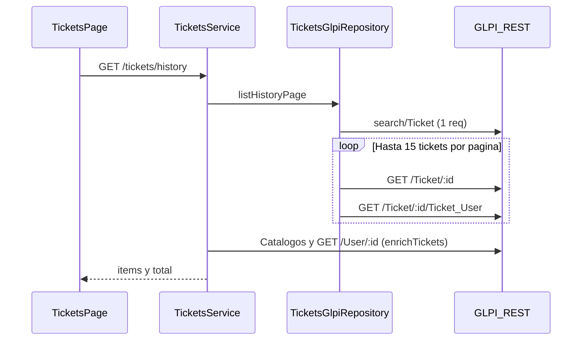
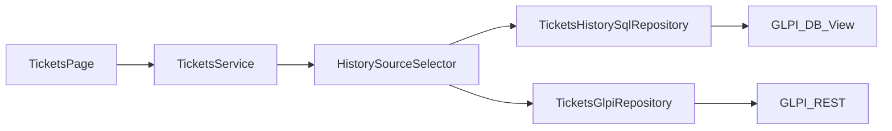

# Optimizacion del Historial - vista GLPI y alternativas

## Objetivo

Reducir la latencia del apartado Historial manteniendo el contrato actual de `GET /tickets/history`, documentando dos caminos:

- Opcion A: optimizacion rapida sin acceso SQL directo.
- Opcion B: vista SQL en la BD de GLPI con lectura directa.

La recomendacion es implementar primero la Opcion A (bajo riesgo y despliegue rapido) y avanzar a la Opcion B si no se cumple el SLA de performance.

## Alcance y entregable

Este documento define implicaciones tecnicas, operativas y de seguridad, junto con un plan paso a paso para llevar la mejora a produccion.

No requiere cambios en frontend si se mantiene `TicketListResponseDto`:

- `D:/Proyectos/Portería/porteria_back/src/modules/tickets/dto/ticket.response.dto.ts`

## Diagnostico del estado actual

### Flujo actual



### Punto de entrada relevante

- Backend:
  - `D:/Proyectos/Portería/porteria_back/src/modules/tickets/tickets.service.ts` (`listHistory`)
  - `D:/Proyectos/Portería/porteria_back/src/modules/glpi/repositories/tickets.glpi-repository.ts` (`listHistoryPage`)
- Frontend:
  - `D:/Proyectos/Portería/porteria_front/src/services/ticketsService.ts` (`listHistoryTickets`)
  - `D:/Proyectos/Portería/porteria_front/src/hooks/useTickets.ts`

### Causa principal de lentitud

Para cada pagina de historial, el backend dispara una combinacion de llamadas que escala por ticket:

1. Una busqueda paginada en `search/Ticket`.
2. Hasta 15 llamadas `GET /Ticket/:id`.
3. Hasta 15 llamadas `GET /Ticket/:id/Ticket_User`.
4. Enriquecimiento de usuarios (una llamada por actor distinto), mas catalogos.

Orden de magnitud: ~31 a 50 requests HTTP por pagina, segun cardinalidad de actores y cache.

### Caso degradado con filtro por tipo

Cuando se filtra por `type`, `listHistoryPage` puede caer en el camino de `list()` y terminar cargando muchos IDs, empeorando la latencia total.

### Diferencia con metricas TI

El flujo de metricas ya usa mapeo desde fila de search (`domainTicketFromSearchRow`) sin ir a `GET /Ticket/:id` para cada ticket. El historial no aprovecha ese patron en el camino principal.

### Datos que necesita la grilla

La tabla de historial en frontend utiliza: id, apertura, solicitante, tipo, titulo, estado, asignado y ubicacion. No necesita `description` para renderizar el listado.

## Opcion A - Quick win sin SQL directo

### Idea

Reusar directamente las filas de `search/Ticket` para construir `DomainTicket` en historial, eliminando lecturas por ticket (`GET /Ticket/:id`) en el listado.

### Pros

- Esfuerzo bajo.
- Menor riesgo operativo.
- Sin nuevas credenciales de BD.
- Rollback sencillo.

### Contras

- Sigue dependiendo del rendimiento del search de GLPI.
- Puede persistir parte de la variabilidad del indice interno de GLPI.
- El enriquecimiento de actores puede seguir agregando costo si no se ajusta.

### Pasos de implementacion (Opcion A)

1. En `searchHistoryTicketsPage`, mapear filas con `domainTicketFromSearchRow`.
2. Evitar `fetchTicketsByIdsInternal` para el listado de historial.
3. Revisar si `attachTicketActors` sigue siendo necesario segun consistencia observada.
4. Unificar el camino de filtro por `type` para no degradar a `list()` masivo.
5. Medir p50/p95 de `GET /tickets/history` antes y despues.
6. Definir umbral de salida para decidir si pasar a Opcion B.

## Opcion B - Vista SQL GLPI + lectura directa

### Idea

Crear una vista SQL que ya proyecte ticket + actores + ubicacion + categoria, y consultar historial con una sola query paginada (mas count) desde backend via usuario read-only.

### Precondicion tecnica

Actualmente el backend no tiene cliente MySQL declarado para este uso. Se requerira incorporar driver (`mysql2`) y configuracion de conexion dedicada de solo lectura.

### SQL de referencia (borrador)

```sql
CREATE OR REPLACE VIEW v_porteria_ticket_history AS
SELECT
  t.id,
  t.name AS subject,
  t.status,
  t.type,
  t.urgency,
  t.itilcategories_id AS category_id,
  cat.name AS category_name,
  t.locations_id AS location_id,
  loc.name AS location_name,
  t.entities_id,
  t.date AS created_at,
  t.date_mod AS updated_at,
  t.is_deleted,
  req.users_id AS requester_id,
  ru.realname AS requester_realname,
  ru.firstname AS requester_firstname,
  ru.name AS requester_login,
  tech.users_id AS technician_id,
  tu.realname AS technician_realname,
  tu.firstname AS technician_firstname,
  tu.name AS technician_login
FROM glpi_tickets t
LEFT JOIN glpi_tickets_users req
  ON req.tickets_id = t.id AND req.type = 1
LEFT JOIN glpi_users ru ON ru.id = req.users_id
LEFT JOIN glpi_tickets_users tech
  ON tech.tickets_id = t.id AND tech.type = 2
LEFT JOIN glpi_users tu ON tu.id = tech.users_id
LEFT JOIN glpi_itilcategories cat ON cat.id = t.itilcategories_id
LEFT JOIN glpi_locations loc ON loc.id = t.locations_id
WHERE t.is_deleted = 0;
```

### Ajustes obligatorios antes de produccion

- Resolver multiplicidad de actores (si hay mas de un tecnico/solicitante).
- Aplicar filtro de entidad (`entities_id`) alineado a la entidad activa del sistema.
- Replicar semantica de ubicacion `under` en la query de listado.

Ejemplo de condicion para ubicacion jerarquica (validar formato de `sons_cache` en su GLPI):

```sql
AND t.locations_id IN (
  SELECT l.id
  FROM glpi_locations l
  WHERE l.id = :locationId
     OR l.sons_cache LIKE CONCAT('%>', :locationId, '>%')
)
```

## Implicaciones y riesgos

### Acoplamiento al esquema GLPI

- Cambios de version de GLPI pueden impactar nombres de tablas/columnas.
- Se requiere runbook de validacion en cada upgrade.

### Seguridad

- Usuario read-only exclusivo para historial.
- Rotacion de password y secreto fuera del repo.
- Restriccion de red (allowlist) y TLS si aplica.

### Permisos y visibilidad

- La API de GLPI aplica reglas de perfil/entidad; SQL directo no.
- Hay que garantizar filtrado por rol y entidad en backend para no exponer mas tickets.

### Operacion

- Migracion de vista versionada por ambiente.
- Fallback configurable a API para rollback rapido.
- Monitoreo de latencia SQL y errores de pool.

### Consistencia de lectura

- Si la consulta va contra replica, puede haber lag.
- Definir SLA esperado de propagacion para tickets recien creados/actualizados.

## Validar en BD (paso previo obligatorio)

Antes de implementar Opcion B, ejecutar validaciones en GLPI real:

1. Confirmar estructura actual de tablas objetivo:
   - `glpi_tickets`
   - `glpi_tickets_users`
   - `glpi_users`
   - `glpi_locations`
   - `glpi_itilcategories`
2. Verificar formato real de `sons_cache` para soportar filtro `under`.
3. Medir incidencia de tickets con multiples tecnicos/solicitantes y definir regla determinista.
4. Confirmar uso de `entities_id` y politica multi-entidad en el entorno.
5. Validar volumen y cardinalidad para dimensionar indices.

Sin esta validacion, no avanzar a produccion con SQL directo.

## Indices recomendados (coordinar con DBA)

- `glpi_tickets (is_deleted, date_mod DESC)`
- `glpi_tickets (status)`
- `glpi_tickets (locations_id)`
- `glpi_tickets (entities_id)`
- `glpi_tickets_users (users_id, type)`
- `glpi_tickets_users (tickets_id, type)`

## Arquitectura objetivo (Opcion B)



## Plan de ejecucion propuesto

### Fase 1 - Quick win

1. Reducir roundtrips del historial en backend (Opcion A).
2. Medir performance y error rate.
3. Si cumple SLA, estabilizar y cerrar.

### Fase 2 - SQL directo (si aun no cumple)

1. Validacion de esquema y datos en BD.
2. Crear vista en DEV y analizar planes (`EXPLAIN`).
3. Agregar modulo de acceso SQL read-only en backend.
4. Implementar repositorio `TicketsHistorySqlRepository`.
5. Agregar flag `GLPI_HISTORY_SOURCE=api|sql`.
6. Ejecutar comparativas API vs SQL en muestreo.
7. Desplegar vista + activar flag progresivamente.
8. Mantener fallback a API durante periodo de observacion.

## Checklist de pruebas funcionales y de rendimiento

- Tecnico solo ve tickets permitidos.
- Solicitante solo ve tickets propios.
- Estados default: `assigned` y `planned`.
- Filtro por sede incluye hijas (`under`).
- Busqueda por ID y por titulo.
- Paginacion y total coherentes.
- Tickets nuevos visibles en ventana esperada.
- Cambio de estado reflejado tras refresh.
- p95 de `GET /tickets/history` dentro del objetivo acordado.

## Comparativa resumida

| Criterio | Opcion A (API) | Opcion B (Vista SQL) |
|---|---|---|
| Esfuerzo | Bajo | Medio/alto |
| Riesgo | Bajo | Medio |
| Ganancia estimada | Alta | Muy alta |
| Dependencia GLPI | Search REST | Esquema SQL |
| Rollback | Revert de codigo | Flag a `api` |

## Recomendacion final

Aplicar enfoque incremental:

1. Ejecutar Opcion A y medir.
2. Si no alcanza objetivo, avanzar con Opcion B con feature flag y gobernanza de BD.

Este enfoque minimiza riesgo, permite mejoras rapidas y preserva control operativo para rollback.
