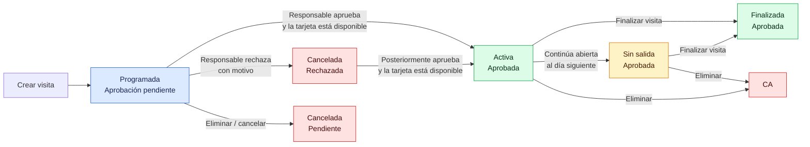
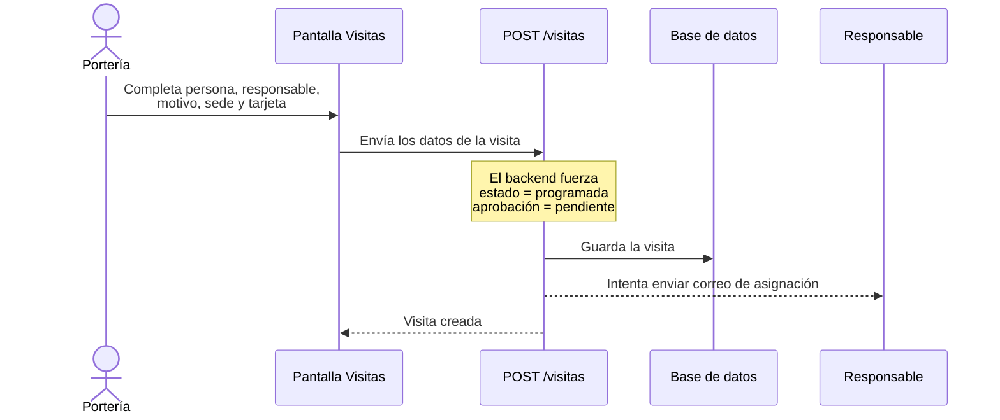
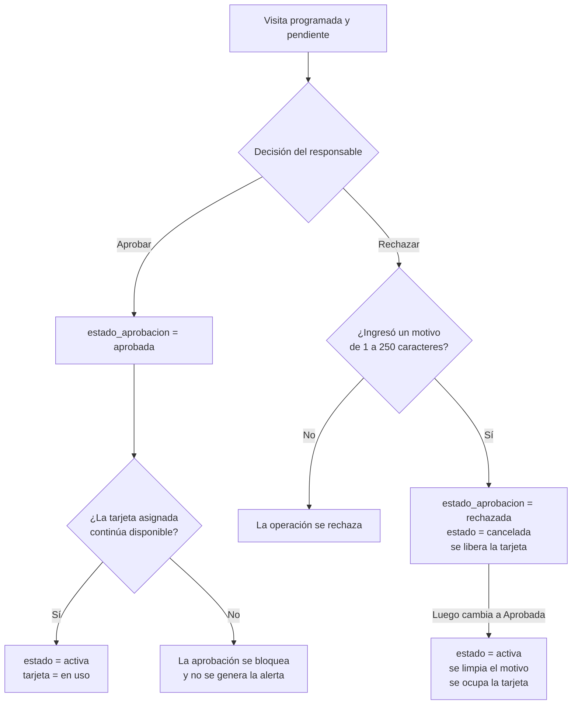
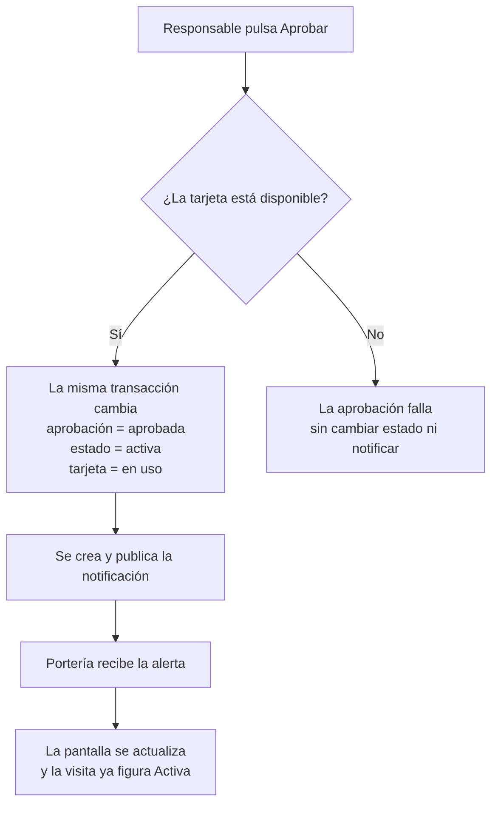
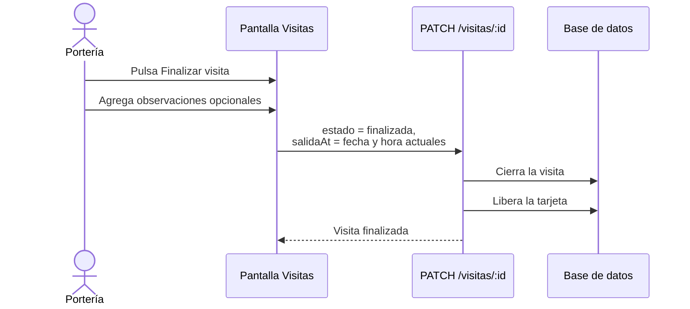
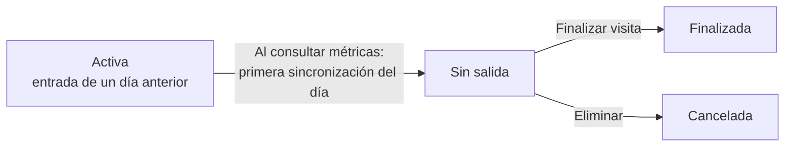
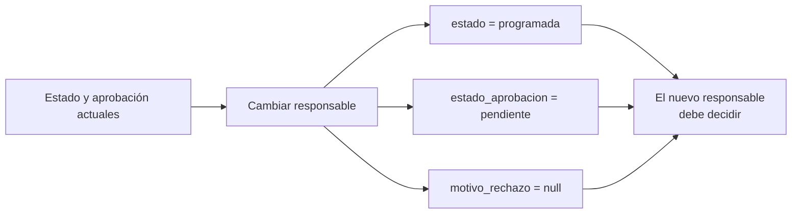
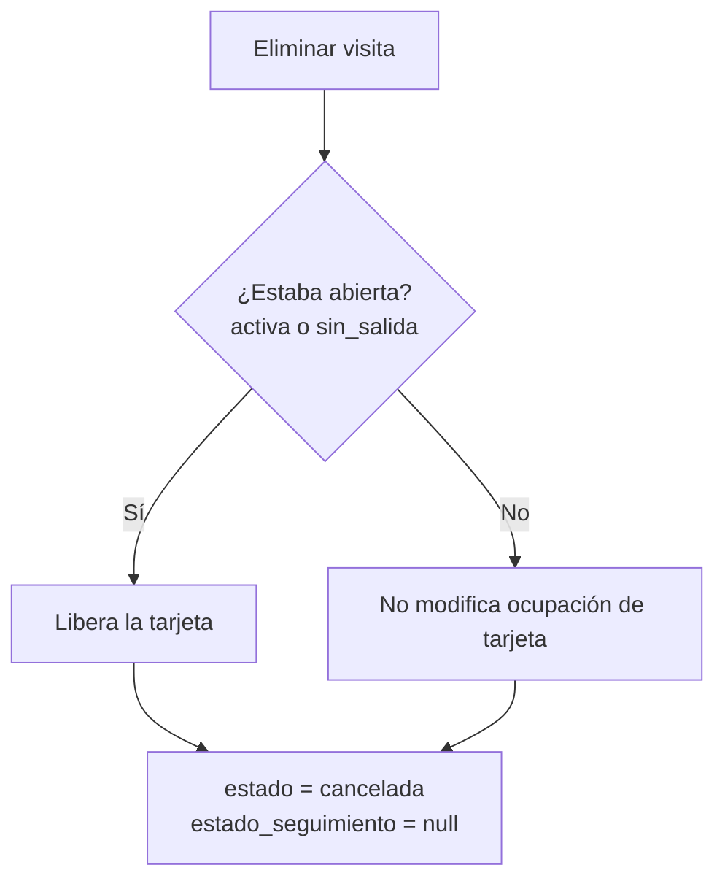
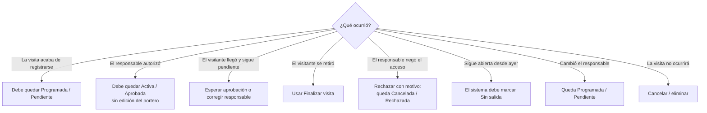

# Ciclo de vida y casos de uso de visitas

> Estado documentado según el código al 15 de julio de 2026.

## Objetivo

Esta guía ayuda a decidir qué acción realizar y qué estado esperar durante la gestión de una visita. El sistema mantiene dos datos independientes:

| Dimensión | Campo | Valores | Pregunta que responde |
| --- | --- | --- | --- |
| Estado operativo | `estado` | `programada`, `activa`, `sin_salida`, `finalizada`, `cancelada` | ¿En qué etapa del ingreso se encuentra? |
| Aprobación | `estado_aprobacion` | `pendiente`, `aprobada`, `rechazada` | ¿El responsable autorizó la visita? |

Una aprobación exitosa inicia automáticamente el ingreso: la visita pasa a **activa y aprobada** antes de que Portería reciba la alerta.

## Vista general



## Qué significa cada estado operativo

| Estado | Significado práctico | ¿Ocupa la tarjeta? | Cómo se alcanza |
| --- | --- | --- | --- |
| `programada` | Está registrada y espera la decisión del responsable. | No | Al crearla o al cambiar el responsable. |
| `activa` | Fue aprobada; el ingreso comenzó automáticamente y aún no tiene salida. | Sí | El responsable aprueba y la tarjeta asignada continúa disponible. |
| `sin_salida` | Quedó abierta desde un día anterior. | Sí | El backend la asigna automáticamente; no puede seleccionarse manualmente. |
| `finalizada` | La salida fue registrada. | No | Se usa la acción **Finalizar visita** o se cambia el estado a **Finalizada**. |
| `cancelada` | La visita no continuará. | No | Se rechaza, se elimina/cancela o se selecciona **Cancelada**. |

Los únicos estados considerados abiertos son `activa` y `sin_salida`. Por eso son los únicos que mantienen una tarjeta en uso.

## Caso 1: crear una visita



### Resultado esperado

```text
estado = programada
estado_aprobacion = pendiente
```

Aunque el formulario nuevo mantiene internamente `estado = activa`, el backend no utiliza ese valor al crear: toda visita nueva queda programada.

## Caso 2: aprobar o rechazar



### Reglas

- Aprobar inicia el ingreso automáticamente: la visita pasa a `activa` y se ocupa su tarjeta en la misma transacción.
- La alerta se publica después de confirmar la actualización; cuando Portería la ve, la visita ya está activa.
- Si la tarjeta está inactiva, ocupada o asociada a otra visita abierta, la aprobación se bloquea y no se publica la alerta.
- Rechazar exige un motivo y cambia el estado operativo a `cancelada`.
- Una visita rechazada puede aprobarse después; si la tarjeta está disponible, pasa directamente a `activa`.
- Una visita ya aprobada no puede cambiar nuevamente su aprobación mediante el flujo de aprobación.
- La decisión genera una notificación interna para los destinatarios correspondientes; no envía correo.

## Caso 3: inicio automático del ingreso

El portero no necesita editar la visita después de la aprobación. El inicio ocurre como parte de la decisión del responsable:



La interfaz de aprobación envía una decisión equivalente a:

```http
PATCH /encargado-visita/visitas/:id/aprobacion
Content-Type: application/json

{
  "estadoAprobacion": "aprobada"
}
```

### Resultado esperado

```text
estado = activa
estado_aprobacion = aprobada
tarjeta.en_uso = true
```

El backend comprueba y ocupa la tarjeta de forma atómica. Así evita mostrar la alerta de aprobación si no pudo iniciar realmente la visita.

## Caso 4: registrar la salida

Para una visita `activa` o `sin_salida`, la tabla muestra la acción **Finalizar visita**.



### Resultado esperado

```text
estado = finalizada
salida_at = momento de finalización
estado_seguimiento = null
tarjeta.en_uso = false
```

## Caso 5: visita que quedó abierta



`sin_salida` es un estado automático. La revisión se dispara al consultar `GET /visitas/metrics` y se ejecuta como máximo una vez por día por instancia del backend. En ese momento se actualizan las visitas `activas` cuya `entrada_at` es anterior al comienzo del día actual. No se admite enviar manualmente `estado = sin_salida` en una creación o actualización.

## Caso 6: cambiar el responsable

Cambiar el responsable reinicia el flujo de autorización:



Esto ocurre incluso si la visita estaba aprobada. Cuando el nuevo responsable la apruebe, volverá a quedar activa automáticamente.

## Caso 7: cancelar o eliminar

En la implementación actual, la operación `DELETE /visitas/:id` no borra físicamente el registro: lo conserva como `cancelada` y registra auditoría.



## Árbol rápido de decisión para Portería



## Matriz de casos frecuentes

| Situación | Acción | Resultado esperado |
| --- | --- | --- |
| Se registra una visita nueva | Crear | `programada` + `pendiente` |
| El responsable autoriza y la tarjeta está libre | Aprobar | `activa` + `aprobada`; tarjeta en uso y alerta a Portería |
| El responsable autoriza y la tarjeta no está disponible | Aprobar | Se bloquea; continúa sin aprobar y no se genera alerta |
| El visitante llega sin aprobación | Esperar la decisión | Continúa `programada` + `pendiente` |
| El responsable niega el acceso | Rechazar e indicar motivo | `cancelada` + `rechazada` |
| Se reconsidera una visita rechazada | Aprobar | `activa` + `aprobada`, si la tarjeta está disponible |
| Se asigna otro responsable | Editar responsable | `programada` + `pendiente` |
| El visitante sale | Finalizar visita | `finalizada` y tarjeta liberada |
| La visita sigue abierta al día siguiente | Sin acción manual | `sin_salida` automáticamente |
| La visita no se realizará | Eliminar/cancelar | `cancelada` |

## Aclaración sobre las fechas

`entrada_at` se completa durante la creación con la fecha indicada en el formulario o con la fecha actual. Por lo tanto, **tener `entrada_at` no demuestra que el visitante haya ingresado**.

La señal operativa actual del check-in es la aprobación exitosa:

```text
estado_aprobacion cambia a aprobada
estado cambia de programada o cancelada a activa
la tarjeta cambia a en_uso = true
```

La señal del check-out es:

```text
estado cambia a finalizada y se completa salida_at
```

Esta diferencia debe tenerse en cuenta en reportes, métricas y auditorías.

## Datos relacionados que no deben confundirse

- Una aprobación exitosa autoriza y, a la vez, inicia el ingreso cambiando el estado a `activa`.
- `entrada_at` es una fecha de referencia cargada al crear; actualmente no es un sello exclusivo del check-in.
- `salida_at` registra la salida al finalizar.
- `estado_seguimiento` describe el seguimiento en tiempo real, pero no sustituye al estado operativo.
- La tarjeta se considera ocupada solamente con `estado = activa` o `estado = sin_salida`.

## Referencias en el código

- `src/modules/visitas/visitas.service.ts`: creación, actualización, validación de aprobación, sincronización de tarjetas, cancelación y asignación automática de `sin_salida`.
- `src/modules/visitas/encargado-visita-visitas.service.ts`: reglas para aprobar y rechazar.
- `src/modules/visitas/repositories/encargado-visita-visitas.sql-repository.ts`: transición de aprobación a activa, ocupación atómica de tarjeta y rechazo a cancelación.
- `src/modules/visitas/repositories/visitas.sql-repository.ts`: persistencia y cambio automático a `sin_salida`.
- `src/modules/visitas/domain/visita-estado.helpers.ts`: definición de estados abiertos.
- `../porteria_front/src/pages/VisitasPage.tsx`: formulario de creación y edición.
- `../porteria_front/src/components/visitas/VisitasTable.tsx`: acciones de editar y finalizar.
- `../porteria_front/src/api/visitas.ts`: llamadas HTTP para crear, actualizar y finalizar.
